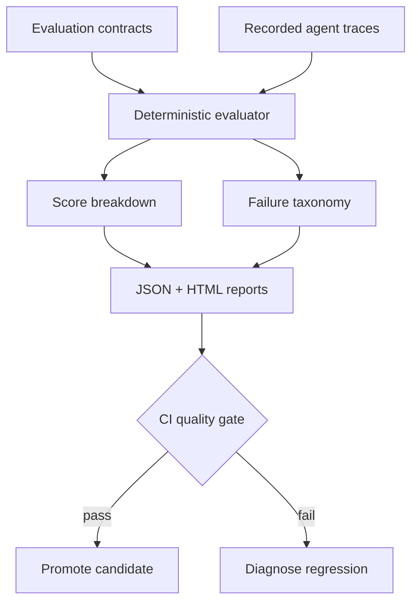

# Agent Reliability Lab

[](https://github.com/cagataykavas/agent-reliability-lab/actions/workflows/ci.yml)
[](https://www.python.org/downloads/)
[](LICENSE)

> Deterministic evaluation, failure analysis and CI quality gates for production tool-using AI agents.

Agent Reliability Lab evaluates **recorded agent behavior against explicit contracts**. It measures whether an agent selected the right tools, supplied the right arguments, preserved required call order, cited required evidence, stayed inside latency/cost budgets and escalated only when policy required it.

The core evaluator is model- and framework-independent. It does not need an API key, an LLM provider or network access, so the same recorded trace produces the same result locally and in CI.

All included tasks, traces and policies are synthetic. No employer data, prompts, customer records or proprietary agent behavior are included.

## Why this project exists

An agent demo can succeed once while remaining unsafe to ship. Production questions are different:

- Did it call the correct tool, or merely produce a plausible final sentence?
- Were arguments correct and calls made in a valid order?
- Can every important claim be tied to approved evidence?
- Did it exceed latency or token-cost budgets?
- Did it escalate ambiguous/high-risk work to a human?
- When a case fails, is the failure machine-readable and actionable?
- Can regressions block a pull request before deployment?

This repository turns those questions into executable evaluation contracts.

## Implemented capabilities

| Area | Implementation |
| --- | --- |
| Tool selection | duplicate-aware precision/recall/F1 over expected and observed calls |
| Argument evaluation | required key/value correctness for matched tool invocations |
| Trajectory order | ordered-subsequence validation for multi-tool workflows |
| Evidence grounding | required evidence-ID coverage independent from answer fluency |
| Answer contract | case-insensitive required-fact coverage for deterministic smoke checks |
| Operational budgets | per-case latency and cost ceilings |
| Human review | expected-vs-observed escalation correctness |
| Failure taxonomy | ten structured failure categories with readable diagnostics |
| Missing data | explicit failed result for a missing trace; unknown/duplicate IDs rejected |
| Reports | machine-readable JSON and standalone responsive HTML |
| CI gate | configurable minimum suite pass rate and non-zero failure exit |
| Regression analysis | paired baseline/candidate deltas with case-level regression detection |
| Fault injection | seven deterministic corruption modes for evaluation-suite validation |
| Portability | dependency-free core, installable CLI, Docker image, Python 3.11–3.13 CI |

## Architecture



The evaluation layer is deliberately separated from live execution. Provider-specific adapters can record traces, while this package remains a stable and auditable scoring boundary.

## Quick start

```bash
python -m venv .venv
source .venv/bin/activate  # Windows: .venv\Scripts\activate
pip install -e '.[dev]'

agent-reliability \
  examples/cases.jsonl \
  examples/traces.jsonl \
  --fail-under 1.0
```

Expected summary:

```json
{
  "total_cases": 3,
  "passed_cases": 3,
  "pass_rate": 1.0,
  "mean_score": 1.0,
  "pass_threshold": 0.8,
  "failure_counts": {}
}
```

The command writes:

```text
artifacts/report.json
artifacts/report.html
```

Run the same benchmark without installing a console script:

```bash
python -m agent_reliability examples/cases.jsonl examples/traces.jsonl
```

## Evaluation contract

Each JSONL case defines observable expectations:

```json
{
  "case_id": "refund-review",
  "prompt": "Refund order O-77 if policy permits it.",
  "expected_tools": [
    {"name": "get_order", "arguments": {"order_id": "O-77"}},
    {"name": "get_refund_policy", "arguments": {"region": "TR"}}
  ],
  "required_evidence": ["order:O-77", "policy:refund:TR"],
  "max_latency_ms": 1400,
  "max_cost_usd": 0.02,
  "should_escalate": true,
  "reference_answer_contains": ["manual review"]
}
```

The corresponding recorded trace contains only observable execution facts:

```json
{
  "case_id": "refund-review",
  "final_answer": "The refund requires manual review under the regional policy.",
  "tool_calls": [
    {"name": "get_order", "arguments": {"order_id": "O-77"}},
    {"name": "get_refund_policy", "arguments": {"region": "TR"}}
  ],
  "evidence_ids": ["order:O-77", "policy:refund:TR"],
  "total_latency_ms": 690,
  "total_cost_usd": 0.008,
  "escalated": true
}
```

## Scoring model

The default score is a transparent weighted combination:

| Component | Weight |
| --- | ---: |
| Tool selection | 24% |
| Argument correctness | 20% |
| Tool order | 10% |
| Evidence coverage | 16% |
| Answer coverage | 10% |
| Budget compliance | 10% |
| Escalation correctness | 10% |

Every component is available separately in the JSON report. The score is not presented as a universal measure of agent quality; it is an explicit release policy that teams can inspect and extend.

An unhandled trace error applies an additional penalty and always fails the case. A missing trace is converted into an explicit `unhandled_error` result rather than silently disappearing from aggregate metrics.

## Failure taxonomy

```text
missing_tool             expected capability was never called
unexpected_tool          extra or policy-disallowed tool was called
wrong_arguments          matched tool received incorrect required arguments
wrong_tool_order         expected multi-step order was not preserved
missing_evidence         required evidence IDs were not cited
budget_exceeded          latency or cost ceiling was crossed
unhandled_error          execution ended with an unresolved error
unsafe_completion        deterministic answer contract was not satisfied
unnecessary_escalation   safe case was sent to human review
missing_escalation       review-required case was handled automatically
```

This split matters because the remediation is different for each failure: retrieval, tool schema, routing policy, budget control and escalation logic should not collapse into one opaque “agent score.”

## CI quality gate

The workflow runs linting, tests and the example benchmark on Python 3.11, 3.12 and 3.13. The benchmark can fail CI when the pass rate drops:

```bash
agent-reliability cases.jsonl traces.jsonl --threshold 0.85 --fail-under 0.95
```

`--threshold` controls the minimum score for an individual case. `--fail-under` controls the required fraction of passing cases across the suite.

## Fault injection and regression testing

An evaluation suite should prove that it detects known failures. Generate deterministic corrupted traces:

```bash
agent-reliability-inject \
  examples/traces.jsonl \
  artifacts/faulty-traces.jsonl \
  --fault drop_evidence
```

Available faults cover dropped evidence, corrupted arguments, unexpected tools, latency/cost overruns, flipped escalation and unhandled errors. `--every 3` injects the selected fault into every third trace, making mixed pass/fail suites reproducible.

Compare candidate traces against an approved baseline:

```bash
agent-reliability-compare \
  examples/cases.jsonl \
  examples/traces.jsonl \
  artifacts/faulty-traces.jsonl
```

The comparison fails with a non-zero exit when the candidate omits baseline cases, exceeds allowed mean/pass-rate drops or regresses more individual cases than policy permits. This makes agent behavior a reviewable CI release gate rather than a dashboard someone may or may not inspect.

## Docker

```bash
docker build -t agent-reliability-lab .
docker run --rm agent-reliability-lab
```

Mount evaluation files and override the default arguments for another suite:

```bash
docker run --rm \
  -v "$PWD/my-evals:/evals:ro" \
  agent-reliability-lab \
  /evals/cases.jsonl /evals/traces.jsonl --fail-under 0.95
```

## Repository structure

```text
src/agent_reliability/
  models.py       typed contracts, results and failure taxonomy
  scoring.py      deterministic component scoring and suite aggregation
  io.py           validated JSONL loading with line-level diagnostics
  reporting.py    JSON and standalone HTML report generation
  cli.py          command-line quality gate
examples/         synthetic evaluation contracts and passing traces
tests/            scoring, validation and reporting regression tests
.github/workflows CI matrix and published report artifact
```

## Design boundaries

- Required-fact matching is a deterministic smoke check, not a semantic judge.
- Argument comparison intentionally checks expected key/value pairs; domain-specific equivalence needs an extension.
- Evidence IDs prove trace linkage, not that a source itself is true.
- The core evaluates recorded traces and does not execute arbitrary tools.
- Scores are meaningful only relative to a reviewed evaluation suite and release policy.

These limits are explicit because reliable evaluation requires knowing exactly what a metric does—and what it does not prove.

## Roadmap

- provider/framework trace adapters;
- trajectory perturbation and fault injection;
- pairwise candidate comparison;
- statistical confidence intervals and regression significance;
- OpenTelemetry-compatible span ingestion;
- FastAPI evaluation service and run registry;
- benchmark history dashboard;
- policy packs for RAG, support and human-review agents.

## License

[MIT](LICENSE)
