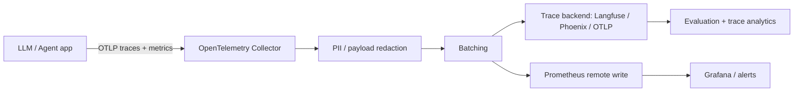

# LLM & Agent Observability Reference

This repository now includes a small, framework-neutral reference layer for reasoning about LLM/agent telemetry before wiring it to a production backend.

The goal is not to claim production-scale SRE experience. The goal is to make the reliability concerns executable: trace aggregation, token/cost accounting, PII redaction, SLO evaluation, deterministic export identity and collector configuration.

## Reference architecture



The collector is intentionally placed before fan-out so sensitive attributes can be removed once, before any downstream backend receives them.

## Telemetry model

`agent_reliability.telemetry` provides dependency-free primitives for recorded spans. A span can carry conventional LLM metadata such as:

```text
gen_ai.operation.name = chat | execute_tool
llm.usage.input_tokens
llm.usage.output_tokens
llm.cost.usd
llm.prompt.version
```

A trace summary derives:

- end-to-end latency;
- span count and error count;
- model-call and tool-call counts;
- input/output token totals;
- total request cost;
- prompt versions observed in the trace.

This split is useful because an agent request can fail in several independent layers: model invocation, retrieval, tool execution, policy checks or downstream dependencies.

## Redaction policy

Telemetry frequently contains more sensitive data than application developers expect. Prompts, completions, HTTP headers, user identifiers and tool arguments can all carry PII or credentials.

The Python redaction helper recursively removes values based on exact keys and configurable key fragments. The Collector example additionally deletes common sensitive attributes before telemetry is exported.

A production policy should be stricter:

1. define an approved telemetry schema;
2. default-deny raw prompts/completions for sensitive workloads;
3. redact before backend fan-out;
4. test redaction with representative payloads;
5. define retention separately for operational metrics and high-cardinality traces;
6. audit RBAC and export access.

## SLO example

The reference target used in the code is deliberately simple:

```text
availability >= 99%
p95 end-to-end latency <= 2 seconds
mean request cost <= configurable budget
```

`evaluate_slos()` evaluates those targets over trace summaries. The Prometheus rules provide equivalent examples for live metrics.

Real SLOs should be scoped by service tier and user journey. A synchronous support assistant, offline evaluation worker and long-running research agent should not share the same latency objective.

## Prompt and model regressions

Prompt changes should be treated like deployable artifacts. Trace metadata should include prompt/model versions so a latency, quality or cost regression can be tied to a specific release.

Useful dimensions include:

```text
service.name
service.version
model.provider
model.name
llm.prompt.version
agent.workflow.version
retrieval.index.version
```

High-cardinality values such as raw user IDs should not become Prometheus labels.

## Incident triage

A minimal LLM incident runbook should distinguish:

- **availability:** provider errors, exhausted quotas, downstream tool failures;
- **latency:** model slowdown, retrieval saturation, retry storms, long agent loops;
- **quality:** prompt/model regressions, retrieval degradation, tool-selection errors;
- **cost:** token inflation, model-routing changes, retries or runaway loops;
- **security:** leaked PII, prompt-injection-driven tool misuse, authorization failures.

During an incident, first identify which dimension regressed, then use trace correlation to isolate the failing span rather than treating the whole request as a single black box.

## Idempotent analytics export

`trace_fingerprint()` creates a deterministic hash from a trace summary. This can be used as an idempotency key when exporting trace/evaluation/cost metadata into an analytics sink.

The fingerprint is not a security primitive and should not replace backend uniqueness constraints. In a real pipeline the sink should enforce a stable key such as `(trace_id, exporter_version)` or an equivalent domain-specific identity.

## Files

```text
src/agent_reliability/telemetry.py   span summaries, redaction, SLOs, fingerprinting
observability/otel-collector.yaml    OTLP ingestion, redaction, batching and fan-out
observability/prometheus-rules.yaml  recording rules and example SLO alerts
tests/test_telemetry.py              regression tests for telemetry primitives
```

Everything in this repository uses synthetic metadata and reference configuration. No production prompts, customer data or employer telemetry are included.
